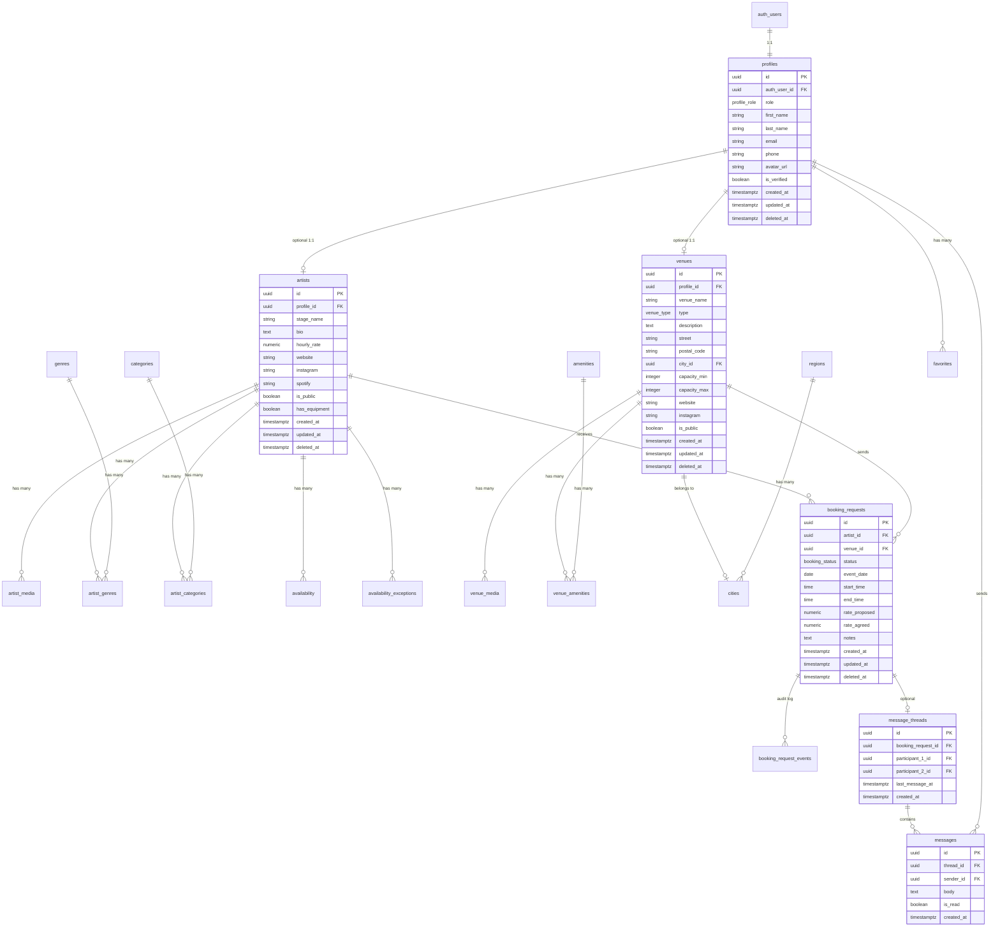

# Database Schema — EA Platform

> **Engine:** PostgreSQL 15+ (Supabase)
> **Primary Keys:** UUID v4
> **Timestamps:** `TIMESTAMPTZ` everywhere
> **Architecture:** Option B — Separate tables for profiles, artists, venues

---

## 1. Overview

### Entity Relationship Diagram



### Design Principles

1. **Supabase Auth Integration** — `auth.users` is the source of truth; `profiles` extends it
2. **Role-Based Extension** — Users become artists/venues by creating rows in extension tables
3. **Soft Delete** — All main entities use `deleted_at` for audit trail
4. **RLS Everywhere** — Every table has Row Level Security policies
5. **German Market Focus** — Regions/cities designed for 16 Bundesländer

### Table Summary

| Category | Tables | Count |
|----------|--------|-------|
| Core | profiles, artists, venues | 3 |
| Media | artist_media, venue_media | 2 |
| Lookup | genres, amenities, categories, regions, cities | 5 |
| Junction | artist_genres, venue_amenities, artist_categories | 3 |
| Booking | booking_requests, booking_request_events | 2 |
| Messaging | message_threads, messages | 2 |
| Discovery | favorites | 1 |
| Calendar | availability, availability_exceptions | 2 |
| **Total** | | **20** |

---

## 2. Enums

### profile_role

```sql
CREATE TYPE profile_role AS ENUM (
    'USER',      -- Default role for new signups
    'ARTIST',    -- Has associated artist record
    'VENUE',     -- Has associated venue record
    'ADMIN'      -- Platform administrator
);
```

### booking_status

```sql
CREATE TYPE booking_status AS ENUM (
    'PENDING',    -- Initial request sent
    'ACCEPTED',   -- Artist accepted the booking
    'DECLINED',   -- Artist declined the booking
    'CANCELLED',  -- Either party cancelled
    'COMPLETED'   -- Event has occurred
);
```

### venue_type

```sql
CREATE TYPE venue_type AS ENUM (
    'BAR',
    'CLUB',
    'RESTAURANT',
    'HOTEL',
    'EVENT_SPACE',
    'OTHER'
);
```

### media_type

```sql
CREATE TYPE media_type AS ENUM (
    'IMAGE',
    'VIDEO',
    'AUDIO'
);
```

### favorite_type

```sql
CREATE TYPE favorite_type AS ENUM (
    'ARTIST',
    'VENUE'
);
```

### category_type

```sql
CREATE TYPE category_type AS ENUM (
    'EVENT_TYPE',   -- e.g., Wedding, Corporate, Club Night
    'MUSIC_GENRE'   -- e.g., House, Techno, Hip-Hop (alternative to genres table)
);
```

### day_of_week

```sql
-- Using SMALLINT 0-6 (Sunday=0 through Saturday=6, JavaScript standard)
-- Not an enum, but documented here for consistency
-- Alternatively can use ISO 8601: 1=Monday through 7=Sunday
```

---

## 3. Tables

### 3.1 Core Tables

#### profiles

Base user profile linked to Supabase Auth. Created automatically via database trigger on `auth.users` insert.

| Column | Type | Nullable | Default | Description |
|--------|------|----------|---------|-------------|
| id | UUID | NO | `gen_random_uuid()` | Primary key |
| auth_user_id | UUID | NO | — | References `auth.users(id)` |
| role | profile_role | NO | `'USER'` | User's platform role |
| first_name | TEXT | NO | — | User's first name |
| last_name | TEXT | NO | — | User's last name |
| email | TEXT | NO | — | Contact email (synced from auth) |
| phone | VARCHAR(20) | YES | NULL | Contact phone (international format) |
| avatar_url | TEXT | YES | NULL | Profile picture URL |
| is_verified | BOOLEAN | NO | FALSE | Admin-verified account |
| created_at | TIMESTAMPTZ | NO | `NOW()` | Record creation time |
| updated_at | TIMESTAMPTZ | NO | `NOW()` | Last update time |
| deleted_at | TIMESTAMPTZ | YES | NULL | Soft delete timestamp |

**Primary Key:** `id`

**Indexes:**
```sql
CREATE UNIQUE INDEX idx_profiles_auth_user_id ON profiles(auth_user_id);
CREATE INDEX idx_profiles_role ON profiles(role);
CREATE INDEX idx_profiles_email ON profiles(email);
CREATE INDEX idx_profiles_active ON profiles(id) WHERE deleted_at IS NULL;
```

**RLS Policies:**
- `profiles_select_own`: Users can read their own profile
- `profiles_select_public`: Users can read verified profiles
- `profiles_update_own`: Users can update their own profile
- `profiles_insert_self`: Triggered by auth, users cannot insert directly

---

#### artists

Artist-specific profile extension. Created when a user becomes an artist.

| Column | Type | Nullable | Default | Description |
|--------|------|----------|---------|-------------|
| id | UUID | NO | `gen_random_uuid()` | Primary key |
| profile_id | UUID | NO | — | References `profiles(id)` |
| stage_name | TEXT | NO | — | Artist's performing name |
| bio | TEXT | YES | NULL | Artist biography |
| hourly_rate | NUMERIC(10,2) | YES | NULL | Base hourly rate in EUR |
| website | TEXT | YES | NULL | Artist website URL |
| instagram | TEXT | YES | NULL | Instagram handle |
| spotify | TEXT | YES | NULL | Spotify artist URL |
| soundcloud | TEXT | YES | NULL | SoundCloud profile URL |
| is_public | BOOLEAN | NO | FALSE | Visible in search results |
| has_equipment | BOOLEAN | NO | FALSE | Brings own equipment |
| years_experience | SMALLINT | YES | NULL | Years of professional experience |
| created_at | TIMESTAMPTZ | NO | `NOW()` | Record creation time |
| updated_at | TIMESTAMPTZ | NO | `NOW()` | Last update time |
| deleted_at | TIMESTAMPTZ | YES | NULL | Soft delete timestamp |

**Primary Key:** `id`

**Indexes:**
```sql
CREATE UNIQUE INDEX idx_artists_profile_id ON artists(profile_id);
CREATE INDEX idx_artists_public ON artists(is_public, created_at) WHERE deleted_at IS NULL;
CREATE INDEX idx_artists_stage_name_gin ON artists USING gin(stage_name gin_trgm_ops);
CREATE INDEX idx_artists_hourly_rate ON artists(hourly_rate) WHERE is_public = TRUE AND deleted_at IS NULL;
```

**RLS Policies:**
- `artists_select_public`: Anyone can view public artists
- `artists_select_own`: Owners can view their own (even if not public)
- `artists_insert_own`: Users can create their own artist profile
- `artists_update_own`: Users can update their own artist profile
- `artists_delete_own`: Users can soft-delete their own artist profile

---

#### venues

Venue-specific profile extension. Created when a user becomes a venue.

| Column | Type | Nullable | Default | Description |
|--------|------|----------|---------|-------------|
| id | UUID | NO | `gen_random_uuid()` | Primary key |
| profile_id | UUID | NO | — | References `profiles(id)` |
| venue_name | TEXT | NO | — | Official venue name |
| type | venue_type | NO | `'OTHER'` | Venue classification |
| description | TEXT | YES | NULL | Venue description |
| street | TEXT | YES | NULL | Street address |
| postal_code | VARCHAR(10) | YES | NULL | German 5-digit postal code |
| city_id | UUID | YES | NULL | References `cities(id)` |
| capacity_min | INTEGER | YES | NULL | Minimum event capacity |
| capacity_max | INTEGER | YES | NULL | Maximum event capacity |
| website | TEXT | YES | NULL | Venue website URL |
| instagram | TEXT | YES | NULL | Instagram handle |
| is_public | BOOLEAN | NO | FALSE | Visible in search results |
| created_at | TIMESTAMPTZ | NO | `NOW()` | Record creation time |
| updated_at | TIMESTAMPTZ | NO | `NOW()` | Last update time |
| deleted_at | TIMESTAMPTZ | YES | NULL | Soft delete timestamp |

**Primary Key:** `id`

**Indexes:**
```sql
CREATE UNIQUE INDEX idx_venues_profile_id ON venues(profile_id);
CREATE INDEX idx_venues_public ON venues(is_public, created_at) WHERE deleted_at IS NULL;
CREATE INDEX idx_venues_name_gin ON venues USING gin(venue_name gin_trgm_ops);
CREATE INDEX idx_venues_type ON venues(type) WHERE is_public = TRUE AND deleted_at IS NULL;
CREATE INDEX idx_venues_city ON venues(city_id) WHERE deleted_at IS NULL;
CREATE INDEX idx_venues_capacity ON venues(capacity_max) WHERE is_public = TRUE AND deleted_at IS NULL;
```

**RLS Policies:**
- `venues_select_public`: Anyone can view public venues
- `venues_select_own`: Owners can view their own (even if not public)
- `venues_insert_own`: Users can create their own venue profile
- `venues_update_own`: Users can update their own venue profile
- `venues_delete_own`: Users can soft-delete their own venue profile

---

### 3.2 Media Tables

#### artist_media

Media files (images, videos, audio) associated with artists.

| Column | Type | Nullable | Default | Description |
|--------|------|----------|---------|-------------|
| id | UUID | NO | `gen_random_uuid()` | Primary key |
| artist_id | UUID | NO | — | References `artists(id)` |
| type | media_type | NO | `'IMAGE'` | Type of media |
| url | TEXT | NO | — | Storage URL |
| thumbnail_url | TEXT | YES | NULL | Thumbnail for videos/images |
| title | TEXT | YES | NULL | Optional title |
| description | TEXT | YES | NULL | Optional description |
| sort_order | INTEGER | NO | 0 | Display order |
| is_primary | BOOLEAN | NO | FALSE | Primary/featured media |
| created_at | TIMESTAMPTZ | NO | `NOW()` | Record creation time |

**Primary Key:** `id`

**Indexes:**
```sql
CREATE INDEX idx_artist_media_artist ON artist_media(artist_id, sort_order);
CREATE INDEX idx_artist_media_primary ON artist_media(artist_id) WHERE is_primary = TRUE;
```

**RLS Policies:**
- `artist_media_select_public`: Anyone can view media of public artists
- `artist_media_insert_own`: Artists can add their own media
- `artist_media_update_own`: Artists can update their own media
- `artist_media_delete_own`: Artists can delete their own media

---

#### venue_media

Media files (images, videos) associated with venues.

| Column | Type | Nullable | Default | Description |
|--------|------|----------|---------|-------------|
| id | UUID | NO | `gen_random_uuid()` | Primary key |
| venue_id | UUID | NO | — | References `venues(id)` |
| type | media_type | NO | `'IMAGE'` | Type of media |
| url | TEXT | NO | — | Storage URL |
| thumbnail_url | TEXT | YES | NULL | Thumbnail for videos/images |
| title | TEXT | YES | NULL | Optional title |
| description | TEXT | YES | NULL | Optional description |
| sort_order | INTEGER | NO | 0 | Display order |
| is_primary | BOOLEAN | NO | FALSE | Primary/featured media |
| created_at | TIMESTAMPTZ | NO | `NOW()` | Record creation time |

**Primary Key:** `id`

**Indexes:**
```sql
CREATE INDEX idx_venue_media_venue ON venue_media(venue_id, sort_order);
CREATE INDEX idx_venue_media_primary ON venue_media(venue_id) WHERE is_primary = TRUE;
```

**RLS Policies:**
- `venue_media_select_public`: Anyone can view media of public venues
- `venue_media_insert_own`: Venues can add their own media
- `venue_media_update_own`: Venues can update their own media
- `venue_media_delete_own`: Venues can delete their own media

---

### 3.3 Lookup Tables

#### genres

Music genres for artist categorization.

| Column | Type | Nullable | Default | Description |
|--------|------|----------|---------|-------------|
| id | UUID | NO | `gen_random_uuid()` | Primary key |
| name | TEXT | NO | — | Genre name (e.g., "House") |
| slug | TEXT | NO | — | URL-safe identifier |
| parent_id | UUID | YES | NULL | Parent genre (for sub-genres) |
| sort_order | INTEGER | NO | 0 | Display order |
| created_at | TIMESTAMPTZ | NO | `NOW()` | Record creation time |

**Primary Key:** `id`

**Indexes:**
```sql
CREATE UNIQUE INDEX idx_genres_slug ON genres(slug);
CREATE INDEX idx_genres_parent ON genres(parent_id);
CREATE INDEX idx_genres_name_gin ON genres USING gin(name gin_trgm_ops);
```

**RLS Policies:**
- `genres_select_all`: Anyone can read genres (public lookup table)

---

#### amenities

Venue amenities/features.

| Column | Type | Nullable | Default | Description |
|--------|------|----------|---------|-------------|
| id | UUID | NO | `gen_random_uuid()` | Primary key |
| name | TEXT | NO | — | Amenity name (e.g., "Outdoor Area") |
| slug | TEXT | NO | — | URL-safe identifier |
| icon | TEXT | YES | NULL | Icon identifier |
| sort_order | INTEGER | NO | 0 | Display order |
| created_at | TIMESTAMPTZ | NO | `NOW()` | Record creation time |

**Primary Key:** `id`

**Indexes:**
```sql
CREATE UNIQUE INDEX idx_amenities_slug ON amenities(slug);
```

**RLS Policies:**
- `amenities_select_all`: Anyone can read amenities (public lookup table)

---

#### categories

Event/booking categories.

| Column | Type | Nullable | Default | Description |
|--------|------|----------|---------|-------------|
| id | UUID | NO | `gen_random_uuid()` | Primary key |
| type | category_type | NO | — | Category classification |
| name | TEXT | NO | — | Category name |
| slug | TEXT | NO | — | URL-safe identifier |
| description | TEXT | YES | NULL | Category description |
| icon | TEXT | YES | NULL | Icon identifier |
| sort_order | INTEGER | NO | 0 | Display order |
| created_at | TIMESTAMPTZ | NO | `NOW()` | Record creation time |

**Primary Key:** `id`

**Indexes:**
```sql
CREATE UNIQUE INDEX idx_categories_type_slug ON categories(type, slug);
CREATE INDEX idx_categories_type ON categories(type);
```

**RLS Policies:**
- `categories_select_all`: Anyone can read categories (public lookup table)

---

#### regions

German federal states (Bundesländer).

| Column | Type | Nullable | Default | Description |
|--------|------|----------|---------|-------------|
| id | UUID | NO | `gen_random_uuid()` | Primary key |
| name | TEXT | NO | — | Region name (e.g., "Hessen") |
| slug | TEXT | NO | — | URL-safe identifier (e.g., "hessen") |
| country_code | CHAR(2) | NO | `'DE'` | ISO country code |
| created_at | TIMESTAMPTZ | NO | `NOW()` | Record creation time |

**Primary Key:** `id`

**Indexes:**
```sql
CREATE UNIQUE INDEX idx_regions_slug ON regions(slug);
CREATE INDEX idx_regions_country ON regions(country_code);
```

**RLS Policies:**
- `regions_select_all`: Anyone can read regions (public lookup table)

**Seed Data Reference (16 Bundesländer):**
- Baden-Württemberg, Bayern, Berlin, Brandenburg, Bremen, Hamburg
- Hessen, Mecklenburg-Vorpommern, Niedersachsen, Nordrhein-Westfalen
- Rheinland-Pfalz, Saarland, Sachsen, Sachsen-Anhalt, Schleswig-Holstein, Thüringen

---

#### cities

Cities within regions.

| Column | Type | Nullable | Default | Description |
|--------|------|----------|---------|-------------|
| id | UUID | NO | `gen_random_uuid()` | Primary key |
| region_id | UUID | NO | — | References `regions(id)` |
| name | TEXT | NO | — | City name (e.g., "Wiesbaden") |
| slug | TEXT | NO | — | URL-safe identifier |
| postal_code_prefix | VARCHAR(2) | YES | NULL | Postal code area (e.g., "65") |
| latitude | NUMERIC(9,6) | YES | NULL | Geographic latitude |
| longitude | NUMERIC(9,6) | YES | NULL | Geographic longitude |
| created_at | TIMESTAMPTZ | NO | `NOW()` | Record creation time |

**Primary Key:** `id`

**Indexes:**
```sql
CREATE UNIQUE INDEX idx_cities_region_slug ON cities(region_id, slug);
CREATE INDEX idx_cities_region ON cities(region_id);
CREATE INDEX idx_cities_name_gin ON cities USING gin(name gin_trgm_ops);
CREATE INDEX idx_cities_postal ON cities(postal_code_prefix);
```

**RLS Policies:**
- `cities_select_all`: Anyone can read cities (public lookup table)

---

### 3.4 Junction Tables

#### artist_genres

Many-to-many relationship between artists and genres.

| Column | Type | Nullable | Default | Description |
|--------|------|----------|---------|-------------|
| id | UUID | NO | `gen_random_uuid()` | Primary key |
| artist_id | UUID | NO | — | References `artists(id)` |
| genre_id | UUID | NO | — | References `genres(id)` |
| is_primary | BOOLEAN | NO | FALSE | Primary genre flag |
| created_at | TIMESTAMPTZ | NO | `NOW()` | Record creation time |

**Primary Key:** `id`

**Indexes:**
```sql
CREATE UNIQUE INDEX idx_artist_genres_unique ON artist_genres(artist_id, genre_id);
CREATE INDEX idx_artist_genres_genre ON artist_genres(genre_id);
CREATE INDEX idx_artist_genres_primary ON artist_genres(artist_id) WHERE is_primary = TRUE;
```

**RLS Policies:**
- `artist_genres_select_public`: Anyone can view genres of public artists
- `artist_genres_manage_own`: Artists can manage their own genre associations

---

#### venue_amenities

Many-to-many relationship between venues and amenities.

| Column | Type | Nullable | Default | Description |
|--------|------|----------|---------|-------------|
| id | UUID | NO | `gen_random_uuid()` | Primary key |
| venue_id | UUID | NO | — | References `venues(id)` |
| amenity_id | UUID | NO | — | References `amenities(id)` |
| created_at | TIMESTAMPTZ | NO | `NOW()` | Record creation time |

**Primary Key:** `id`

**Indexes:**
```sql
CREATE UNIQUE INDEX idx_venue_amenities_unique ON venue_amenities(venue_id, amenity_id);
CREATE INDEX idx_venue_amenities_amenity ON venue_amenities(amenity_id);
```

**RLS Policies:**
- `venue_amenities_select_public`: Anyone can view amenities of public venues
- `venue_amenities_manage_own`: Venues can manage their own amenity associations

---

#### artist_categories

Many-to-many relationship between artists and event categories.

| Column | Type | Nullable | Default | Description |
|--------|------|----------|---------|-------------|
| id | UUID | NO | `gen_random_uuid()` | Primary key |
| artist_id | UUID | NO | — | References `artists(id)` |
| category_id | UUID | NO | — | References `categories(id)` |
| created_at | TIMESTAMPTZ | NO | `NOW()` | Record creation time |

**Primary Key:** `id`

**Indexes:**
```sql
CREATE UNIQUE INDEX idx_artist_categories_unique ON artist_categories(artist_id, category_id);
CREATE INDEX idx_artist_categories_category ON artist_categories(category_id);
```

**RLS Policies:**
- `artist_categories_select_public`: Anyone can view categories of public artists
- `artist_categories_manage_own`: Artists can manage their own category associations

---

### 3.5 Booking Tables

#### booking_requests

Booking requests from venues to artists.

| Column | Type | Nullable | Default | Description |
|--------|------|----------|---------|-------------|
| id | UUID | NO | `gen_random_uuid()` | Primary key |
| artist_id | UUID | NO | — | References `artists(id)` |
| venue_id | UUID | NO | — | References `venues(id)` |
| status | booking_status | NO | `'PENDING'` | Current booking status |
| event_date | DATE | NO | — | Date of the event |
| start_time | TIME | YES | NULL | Event start time |
| end_time | TIME | YES | NULL | Event end time |
| rate_proposed | NUMERIC(10,2) | YES | NULL | Initially proposed rate (EUR) |
| rate_agreed | NUMERIC(10,2) | YES | NULL | Final agreed rate (EUR) |
| event_type | TEXT | YES | NULL | Type of event |
| notes | TEXT | YES | NULL | Additional notes |
| created_at | TIMESTAMPTZ | NO | `NOW()` | Record creation time |
| updated_at | TIMESTAMPTZ | NO | `NOW()` | Last update time |
| deleted_at | TIMESTAMPTZ | YES | NULL | Soft delete timestamp |

**Primary Key:** `id`

**Indexes:**
```sql
CREATE INDEX idx_booking_requests_artist ON booking_requests(artist_id, status) WHERE deleted_at IS NULL;
CREATE INDEX idx_booking_requests_venue ON booking_requests(venue_id, status) WHERE deleted_at IS NULL;
CREATE INDEX idx_booking_requests_date ON booking_requests(event_date) WHERE deleted_at IS NULL;
CREATE INDEX idx_booking_requests_status ON booking_requests(status) WHERE deleted_at IS NULL;
CREATE UNIQUE INDEX idx_booking_requests_unique ON booking_requests(artist_id, venue_id, event_date) WHERE deleted_at IS NULL;
```

**RLS Policies:**
- `booking_requests_select_participant`: Only artist or venue can view their bookings
- `booking_requests_insert_venue`: Only venues can create booking requests
- `booking_requests_update_participant`: Both parties can update (status changes)
- `booking_requests_delete_participant`: Either party can soft-delete

---

#### booking_request_events

Audit log for booking status changes.

| Column | Type | Nullable | Default | Description |
|--------|------|----------|---------|-------------|
| id | UUID | NO | `gen_random_uuid()` | Primary key |
| booking_request_id | UUID | NO | — | References `booking_requests(id)` |
| actor_id | UUID | NO | — | References `profiles(id)` (who made the change) |
| old_status | booking_status | YES | NULL | Previous status |
| new_status | booking_status | NO | — | New status |
| notes | TEXT | YES | NULL | Optional notes about the change |
| created_at | TIMESTAMPTZ | NO | `NOW()` | Record creation time |

**Primary Key:** `id`

**Indexes:**
```sql
CREATE INDEX idx_booking_events_request ON booking_request_events(booking_request_id, created_at);
CREATE INDEX idx_booking_events_actor ON booking_request_events(actor_id);
```

**RLS Policies:**
- `booking_events_select_participant`: Only booking participants can view events
- `booking_events_insert_participant`: Only participants can log events (via trigger)

---

### 3.6 Messaging Tables

#### message_threads

Conversation threads between two users.

| Column | Type | Nullable | Default | Description |
|--------|------|----------|---------|-------------|
| id | UUID | NO | `gen_random_uuid()` | Primary key |
| booking_request_id | UUID | YES | NULL | References `booking_requests(id)` (optional) |
| participant_1_id | UUID | NO | — | References `profiles(id)` |
| participant_2_id | UUID | NO | — | References `profiles(id)` |
| last_message_at | TIMESTAMPTZ | YES | NULL | Timestamp of last message |
| created_at | TIMESTAMPTZ | NO | `NOW()` | Record creation time |

**Constraints:**
```sql
CHECK (participant_1_id < participant_2_id)  -- Ensure consistent ordering
```

**Primary Key:** `id`

**Indexes:**
```sql
CREATE UNIQUE INDEX idx_threads_participants ON message_threads(participant_1_id, participant_2_id);
CREATE INDEX idx_threads_booking ON message_threads(booking_request_id) WHERE booking_request_id IS NOT NULL;
CREATE INDEX idx_threads_participant_1 ON message_threads(participant_1_id, last_message_at DESC);
CREATE INDEX idx_threads_participant_2 ON message_threads(participant_2_id, last_message_at DESC);
```

**RLS Policies:**
- `threads_select_participant`: Only participants can view their threads
- `threads_insert_authenticated`: Authenticated users can create threads
- `threads_update_participant`: Participants can update (last_message_at)

---

#### messages

Individual messages within threads.

| Column | Type | Nullable | Default | Description |
|--------|------|----------|---------|-------------|
| id | UUID | NO | `gen_random_uuid()` | Primary key |
| thread_id | UUID | NO | — | References `message_threads(id)` |
| sender_id | UUID | NO | — | References `profiles(id)` |
| body | TEXT | NO | — | Message content |
| is_read | BOOLEAN | NO | FALSE | Read status |
| created_at | TIMESTAMPTZ | NO | `NOW()` | Record creation time |

**Primary Key:** `id`

**Indexes:**
```sql
CREATE INDEX idx_messages_thread ON messages(thread_id, created_at);
CREATE INDEX idx_messages_sender ON messages(sender_id);
CREATE INDEX idx_messages_unread ON messages(thread_id, is_read) WHERE is_read = FALSE;
```

**RLS Policies:**
- `messages_select_participant`: Only thread participants can view messages
- `messages_insert_participant`: Only thread participants can send messages
- `messages_update_recipient`: Only recipient can mark as read

---

### 3.7 Discovery Tables

#### favorites

User favorites (artists or venues).

| Column | Type | Nullable | Default | Description |
|--------|------|----------|---------|-------------|
| id | UUID | NO | `gen_random_uuid()` | Primary key |
| profile_id | UUID | NO | — | References `profiles(id)` (who favorited) |
| favorite_type | favorite_type | NO | — | Type of entity favorited |
| artist_id | UUID | YES | NULL | References `artists(id)` |
| venue_id | UUID | YES | NULL | References `venues(id)` |
| note | TEXT | YES | NULL | Personal note |
| created_at | TIMESTAMPTZ | NO | `NOW()` | Record creation time |

**Constraints:**
```sql
CHECK (
    (favorite_type = 'ARTIST' AND artist_id IS NOT NULL AND venue_id IS NULL) OR
    (favorite_type = 'VENUE' AND venue_id IS NOT NULL AND artist_id IS NULL)
)
```

**Primary Key:** `id`

**Indexes:**
```sql
CREATE UNIQUE INDEX idx_favorites_artist ON favorites(profile_id, artist_id) WHERE artist_id IS NOT NULL;
CREATE UNIQUE INDEX idx_favorites_venue ON favorites(profile_id, venue_id) WHERE venue_id IS NOT NULL;
CREATE INDEX idx_favorites_profile ON favorites(profile_id, created_at DESC);
```

**RLS Policies:**
- `favorites_select_own`: Users can only view their own favorites
- `favorites_insert_own`: Users can only create their own favorites
- `favorites_delete_own`: Users can only delete their own favorites

---

### 3.8 Calendar Tables

#### availability

Weekly recurring availability for artists.

| Column | Type | Nullable | Default | Description |
|--------|------|----------|---------|-------------|
| id | UUID | NO | `gen_random_uuid()` | Primary key |
| artist_id | UUID | NO | — | References `artists(id)` |
| day_of_week | SMALLINT | NO | — | 0=Sunday through 6=Saturday |
| start_time | TIME | NO | — | Available from |
| end_time | TIME | NO | — | Available until |
| is_available | BOOLEAN | NO | TRUE | Whether available this day |
| created_at | TIMESTAMPTZ | NO | `NOW()` | Record creation time |
| updated_at | TIMESTAMPTZ | NO | `NOW()` | Last update time |

**Constraints:**
```sql
CHECK (day_of_week BETWEEN 0 AND 6)
CHECK (end_time > start_time)
```

**Primary Key:** `id`

**Indexes:**
```sql
CREATE UNIQUE INDEX idx_availability_artist_day ON availability(artist_id, day_of_week);
CREATE INDEX idx_availability_day ON availability(day_of_week, is_available) WHERE is_available = TRUE;
```

**RLS Policies:**
- `availability_select_public`: Anyone can view availability of public artists
- `availability_manage_own`: Artists can manage their own availability

---

#### availability_exceptions

Date-specific overrides to weekly availability.

| Column | Type | Nullable | Default | Description |
|--------|------|----------|---------|-------------|
| id | UUID | NO | `gen_random_uuid()` | Primary key |
| artist_id | UUID | NO | — | References `artists(id)` |
| exception_date | DATE | NO | — | The specific date |
| is_available | BOOLEAN | NO | FALSE | Override availability |
| start_time | TIME | YES | NULL | Custom start time (if available) |
| end_time | TIME | YES | NULL | Custom end time (if available) |
| reason | TEXT | YES | NULL | Reason for exception |
| created_at | TIMESTAMPTZ | NO | `NOW()` | Record creation time |

**Constraints:**
```sql
CHECK (
    is_available = FALSE OR
    (start_time IS NOT NULL AND end_time IS NOT NULL AND end_time > start_time)
)
```

**Primary Key:** `id`

**Indexes:**
```sql
CREATE UNIQUE INDEX idx_exceptions_artist_date ON availability_exceptions(artist_id, exception_date);
CREATE INDEX idx_exceptions_date ON availability_exceptions(exception_date);
```

**RLS Policies:**
- `exceptions_select_public`: Anyone can view exceptions of public artists
- `exceptions_manage_own`: Artists can manage their own exceptions

---

## 4. Relationships

### Foreign Key Reference

| Table | Column | References | ON DELETE |
|-------|--------|------------|-----------|
| profiles | auth_user_id | auth.users(id) | CASCADE |
| artists | profile_id | profiles(id) | CASCADE |
| venues | profile_id | profiles(id) | CASCADE |
| venues | city_id | cities(id) | SET NULL |
| artist_media | artist_id | artists(id) | CASCADE |
| venue_media | venue_id | venues(id) | CASCADE |
| genres | parent_id | genres(id) | SET NULL |
| cities | region_id | regions(id) | CASCADE |
| artist_genres | artist_id | artists(id) | CASCADE |
| artist_genres | genre_id | genres(id) | CASCADE |
| venue_amenities | venue_id | venues(id) | CASCADE |
| venue_amenities | amenity_id | amenities(id) | CASCADE |
| artist_categories | artist_id | artists(id) | CASCADE |
| artist_categories | category_id | categories(id) | CASCADE |
| booking_requests | artist_id | artists(id) | CASCADE |
| booking_requests | venue_id | venues(id) | CASCADE |
| booking_request_events | booking_request_id | booking_requests(id) | CASCADE |
| booking_request_events | actor_id | profiles(id) | CASCADE |
| message_threads | booking_request_id | booking_requests(id) | SET NULL |
| message_threads | participant_1_id | profiles(id) | CASCADE |
| message_threads | participant_2_id | profiles(id) | CASCADE |
| messages | thread_id | message_threads(id) | CASCADE |
| messages | sender_id | profiles(id) | CASCADE |
| favorites | profile_id | profiles(id) | CASCADE |
| favorites | artist_id | artists(id) | CASCADE |
| favorites | venue_id | venues(id) | CASCADE |
| availability | artist_id | artists(id) | CASCADE |
| availability_exceptions | artist_id | artists(id) | CASCADE |

### Cascade Behavior Explained

- **CASCADE**: Child records deleted when parent deleted (used for owned relationships)
- **SET NULL**: Reference set to NULL when parent deleted (used for optional relationships)
- **RESTRICT**: Prevent deletion if children exist (not used in this schema)

---

## 5. Performance Indexes

### GIN Indexes (Full-Text Search)

| Table | Column | Purpose |
|-------|--------|---------|
| artists | stage_name | Fuzzy search for artist names |
| venues | venue_name | Fuzzy search for venue names |
| cities | name | City name autocomplete |
| genres | name | Genre name search |

**Note:** Requires `pg_trgm` extension:
```sql
CREATE EXTENSION IF NOT EXISTS pg_trgm;
```

### Composite Indexes (Common Filter Patterns)

| Index | Columns | Purpose |
|-------|---------|---------|
| idx_artists_public | (is_public, created_at) | List public artists sorted by date |
| idx_venues_public | (is_public, created_at) | List public venues sorted by date |
| idx_booking_requests_artist | (artist_id, status) | Artist's bookings by status |
| idx_booking_requests_venue | (venue_id, status) | Venue's bookings by status |
| idx_threads_participant_1 | (participant_1_id, last_message_at) | User's threads sorted by recent |

### Partial Indexes (Active Records Only)

| Index | Condition | Purpose |
|-------|-----------|---------|
| idx_profiles_active | WHERE deleted_at IS NULL | Query only active profiles |
| idx_artists_public | WHERE deleted_at IS NULL | Query only active artists |
| idx_venues_public | WHERE deleted_at IS NULL | Query only active venues |
| idx_booking_requests_* | WHERE deleted_at IS NULL | Query only active bookings |
| idx_messages_unread | WHERE is_read = FALSE | Quick unread message count |

### B-Tree Indexes (Join Performance)

All foreign key columns have implicit indexes. Additional B-tree indexes for:

| Table | Column(s) | Purpose |
|-------|-----------|---------|
| booking_requests | event_date | Date range queries |
| booking_requests | status | Status filtering |
| availability | day_of_week | Day filtering |
| availability_exceptions | exception_date | Date lookup |

---

## 6. RLS Policies Overview

### Policy Naming Convention

```
{table}_{operation}_{scope}
```

- **operation**: `select`, `insert`, `update`, `delete`
- **scope**: `own`, `public`, `participant`, `authenticated`, `all`

### Common Policy Patterns

#### Self-Access Pattern
```sql
-- Users can only access their own records
CREATE POLICY "profiles_select_own" ON profiles
    FOR SELECT USING (auth.uid() = auth_user_id);
```

#### Public Access Pattern
```sql
-- Anyone can view public records
CREATE POLICY "artists_select_public" ON artists
    FOR SELECT USING (is_public = TRUE AND deleted_at IS NULL);
```

#### Participant Access Pattern
```sql
-- Only booking participants can view
CREATE POLICY "booking_requests_select_participant" ON booking_requests
    FOR SELECT USING (
        artist_id IN (SELECT id FROM artists WHERE profile_id = auth.uid()) OR
        venue_id IN (SELECT id FROM venues WHERE profile_id = auth.uid())
    );
```

#### Owner Modification Pattern
```sql
-- Only owner can modify
CREATE POLICY "artists_update_own" ON artists
    FOR UPDATE USING (
        profile_id = (SELECT id FROM profiles WHERE auth_user_id = auth.uid())
    );
```

### Tables with RLS Enabled

All 20 tables have RLS enabled. Lookup tables (genres, amenities, categories, regions, cities) have permissive SELECT policies for all users.

---

## 7. Database Triggers

### auto_update_timestamp

Automatically updates `updated_at` on row modification.

```sql
CREATE OR REPLACE FUNCTION update_updated_at()
RETURNS TRIGGER AS $$
BEGIN
    NEW.updated_at = NOW();
    RETURN NEW;
END;
$$ LANGUAGE plpgsql;
```

**Applied to:** profiles, artists, venues, booking_requests, availability

### create_profile_on_signup

Creates a profile record when a user signs up via Supabase Auth.

```sql
CREATE OR REPLACE FUNCTION handle_new_user()
RETURNS TRIGGER AS $$
BEGIN
    INSERT INTO public.profiles (auth_user_id, email, first_name, last_name)
    VALUES (
        NEW.id,
        NEW.email,
        COALESCE(NEW.raw_user_meta_data->>'first_name', ''),
        COALESCE(NEW.raw_user_meta_data->>'last_name', '')
    );
    RETURN NEW;
END;
$$ LANGUAGE plpgsql SECURITY DEFINER;

CREATE TRIGGER on_auth_user_created
    AFTER INSERT ON auth.users
    FOR EACH ROW EXECUTE FUNCTION handle_new_user();
```

### update_thread_last_message

Updates message thread's `last_message_at` when a new message is sent.

```sql
CREATE OR REPLACE FUNCTION update_thread_last_message()
RETURNS TRIGGER AS $$
BEGIN
    UPDATE message_threads
    SET last_message_at = NEW.created_at
    WHERE id = NEW.thread_id;
    RETURN NEW;
END;
$$ LANGUAGE plpgsql;

CREATE TRIGGER on_message_created
    AFTER INSERT ON messages
    FOR EACH ROW EXECUTE FUNCTION update_thread_last_message();
```

### log_booking_status_change

Creates audit log entry when booking status changes.

```sql
CREATE OR REPLACE FUNCTION log_booking_status_change()
RETURNS TRIGGER AS $$
BEGIN
    IF OLD.status IS DISTINCT FROM NEW.status THEN
        INSERT INTO booking_request_events (
            booking_request_id, actor_id, old_status, new_status
        ) VALUES (
            NEW.id,
            (SELECT id FROM profiles WHERE auth_user_id = auth.uid()),
            OLD.status,
            NEW.status
        );
    END IF;
    RETURN NEW;
END;
$$ LANGUAGE plpgsql;

CREATE TRIGGER on_booking_status_change
    AFTER UPDATE ON booking_requests
    FOR EACH ROW EXECUTE FUNCTION log_booking_status_change();
```

---

## 8. German Market Considerations

### Address Handling

- **Postal Codes**: German postal codes are exactly 5 digits (VARCHAR(10) allows buffer)
- **Street Format**: German addresses use "Straße Hausnummer" format
- **City/Region**: Venues linked to cities, cities linked to Bundesländer

### Data Privacy (GDPR/DSGVO)

- Soft delete preserves data for legal compliance while hiding from users
- Profile `deleted_at` can trigger data anonymization after retention period
- RLS ensures users can only access their own personal data

### Localization Ready

- All column names in English (per CONVENTIONS.md)
- User-facing content stored as-is (German or English)
- Timestamps use TIMESTAMPTZ for timezone awareness

---

## References

- [CONVENTIONS.md](../../CONVENTIONS.md) — Naming conventions
- [ADR-005: Database Strategy](../decisions/ADR-005-database-strategy.md) — Architecture decision
- [ARCHITECTURE.md](../phase-01-planning/ARCHITECTURE.md) — System architecture

---

**Last Updated:** 2026-02-03
